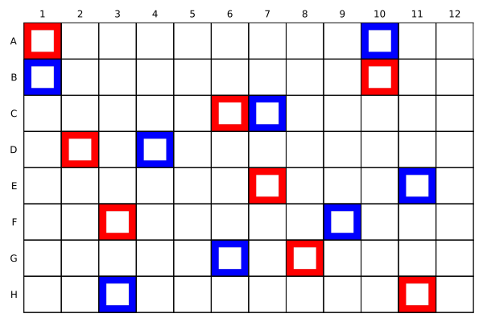

# Quickstart

`PlateArrays.jl` helps you place positive and negative controls on microwell plates. You provide the active wells on the plate and the number of controls to place; [`place_controls`](@ref) optimizes their locations and returns a [`PlateArray`](@ref).


## Create an active plate mask

A plate is represented by a `BitMatrix` mask, where `true` means a well is active (available) and `false` means it is inactive.

For a full 96-well plate:

```julia
wells = trues(8, 12)
```

For a full 384-well plate:

```julia
wells = trues(16, 24)
```

You can also mark some wells as inactive. For example, to exclude the first and last columns:

```julia
wells = trues(8, 12)

wells[:, 1] .= false
wells[:, end] .= false
```

## Placing controls on a single plate 

Use [`place_controls`](@ref) with the plate mask, the number of positive controls, and the number of negative controls.

```julia
plate = place_controls(wells, 8, 8)
```

This places 8 positive controls and 8 negative controls on the active wells of the plate.

The result is a [`PlateArray`](@ref):


## PlateArray objects

A `PlateArray` stores three `BitMatrix` objects:

```julia
plate.wells
plate.positives
plate.negatives
```

- `plate.wells` indicates active wells.
- `plate.positives` indicates positive control wells.
- `plate.negatives` indicates negative control wells.

### Visualizing PlateArrays

Use `plot` to visualize the plate. By default, positive controls are outlined in blue, and negative in red.

```julia 
plot(plate)
```


If a well is inactive, it will appear in a gray color. 

### Exporting PlateArrays

A `PlateArray` can be exported as a `DataFrame` 

```julia 
plate_df = DataFrame(plate)
```

| well | row | col | run | positive | negative | 
| --- | --- | --- | --- | --- | --- | 
| A1 | 1 | 1 | false | false |true | 
| B1 | 2 | 1 | false | true | false| 
| C1| 3 | 1 | true  | false | false | 
| D1 | 4 | 1 | true | false | false | 


Likewise, a properly formatted `DataFrame` can be converted back into a `PlateArray` 

```julia 
new_plate = PlateArray(plate_df)
``` 


### Choosing a solver

By default, [`place_controls`](@ref) uses the `"exchange"` solver.

```julia
plate = place_controls(wells, 8, 8)
```

This is equivalent to:

```julia
plate = place_controls(wells, 8, 8; solver = "exchange")
```

Available solvers are:

| Solver | Description |
| --- | --- |
| `"exchange"` | Default exchange-based optimization solver. |
| `"MILP"` | Mixed-integer linear programming solver. |

To use the MILP solver:

```julia
plate = place_controls(wells, 8, 8; solver = "MILP")
```

!!! note 
    The MILP solver has unpredictable run times and works best for plate sizes up to 96 well plates. 

### Choosing an objective

By default, [`place_controls`](@ref) uses the `"hybrid"` objective.

```julia
plate = place_controls(wells, 8, 8)
```

This is equivalent to:

```julia
plate = place_controls(wells, 8, 8; objective = "hybrid")
```

Available objectives are:

| Objective | Description |
| --- | --- |
| `"hybrid"` | Default weighted combination of the `minimax` and `LHS` objectives. |
| `"minimax"` | Minimizes the maximum distance from an active well to its nearest control. |
| `"LHS"` | Finds an approximate Latin hypercube sample of the available wells. |

For example:

```julia
plate = place_controls(wells, 8, 8; objective = "minimax")
```

You can combine solver and objective choices:

```julia
plate = place_controls(
    wells,
    8,
    8;
    solver = "exchange",
    objective = "minimax",
)
```


## Placing controls with `Experiment` objects

[`Experiment`](@ref) objects wrap the number of runs, positive controls, and negative controls into a single object.

```julia
experiment = Experiment(80, 8, 8)
```

This represents:

- 80 experimental runs
- 8 positive controls
- 8 negative controls

You can also call `place_controls` with `Experiment` objects.

```julia
wells = trues(8, 12)

experiment = Experiment(80, 8, 8)

plate = place_controls(wells, experiment)
```

## Scheduling multiple experiments with `arrayer`

Use [`arrayer`](@ref) to schedule multiple experiments across one or more plates.

```julia
plate_arrays = arrayer(wells, experiment1, experiment2, experiment3)
```

`arrayer` executes three scheduling tasks:

1. Assigns experiments to as few plates as possible.
2. Partitions plates that contain multiple experiments.
3. Places the requested positive and negative controls for each experiment on each plate with `place_controls`.

The result is a matrix of [`PlateArray`](@ref) objects with dimensions `E × P`, where:

- `E` is the number of experiments
- `P` is the number of plates used

Each entry `plate_arrays[e, p]` contains the layout for experiment `e` on plate `p`.

## Example: arraying multiple experiments

```julia
using PlateArrays

# Define a full 96-well plate.
wells = trues(8, 12)

# Define several experiments.
expt1 = Experiment(40, 4, 4)
expt2 = Experiment(32, 4, 4)
expt3 = Experiment(80, 8, 8)

# Assign experiments to plates and place controls.
plate_arrays = arrayer(wells, expt1, expt2, expt3)
```

Inspect the number of experiments and plates:

```julia
size(plate_arrays)
```

The first dimension corresponds to experiments, and the second dimension corresponds to plates.

For example:

```julia
plate_arrays[1, 1]
```

returns the [`PlateArray`](@ref) for the first experiment on the first plate.

If an experiment is not assigned to a particular plate, the corresponding `PlateArray` will contain no active wells.


## Example: irregular plates

The active wells do not need to form a full plate. This example excludes the outer border of a 96-well plate:

```julia
using PlateArrays

wells = trues(8, 12)

wells[1, :] .= false
wells[end, :] .= false
wells[:, 1] .= false
wells[:, end] .= false

plate = place_controls(wells, 4, 4)
```

Controls are placed only where `wells` is `true`.


